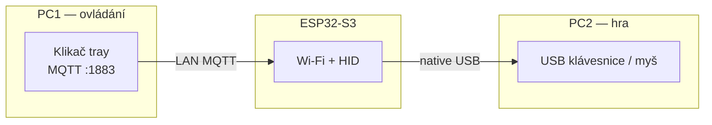

# Klikač

Windows tray aplikace + firmware pro **ESP32-S3**. Destička se na cílovém PC tváří jako USB klávesnice a myš. Ovládání běží na jiném počítači ve stejné Wi‑Fi.

MQTT broker je **součást Klikače** — nic dalšího (Home Assistant, Mosquitto) k provozu nepotřebuješ.

Releasy: [github.com/zmitko/klikac](https://github.com/zmitko/klikac)

## Jak to funguje



1. **PC1** — Klikač v trayi, makro, F-klávesy, přenos kliků myši, MQTT broker.
2. **Destička** — Wi‑Fi na stejné síti, MQTT na IP PC1. HID USB do PC2.
3. **PC2** — vidí obyčejné USB zařízení `USB Input`.

Dva USB na destičce se nepletou:

| Kabel | Kam | K čemu |
| --- | --- | --- |
| CH343 / UART (COM) | PC1 | první flash a zápis Wi‑Fi |
| Native USB (OTG) | PC2 | klávesnice a myš |

## Inicializace (PC1 + PC2)

Potřebuješ **dva USB kabely** (nebo dva porty na destičce) a **stejnou Wi‑Fi** na obou PC.

### 1) PC1 — nainstaluj Klikač a otevři síť

1. Na **PC1** (ovládání, ne herní stroj) nainstaluj Klikač z [Releases](https://github.com/zmitko/klikac/releases), nebo při vývoji spusť `desktop/start.cmd`.
2. Klikač nech běžet (zavření okna ho jen schová do traye — vypíná se přes tray **Exit**).
3. V okně zkontroluj, že dole u destičky svítí **broker** s LAN IP PC1, např. `broker 192.168.1.109:1883`.
4. Jednou ve **správcovském** PowerShellu povol MQTT (když to Klikač bez admin práv neudělal sám):

```powershell
netsh advfirewall firewall add rule name="Klikac MQTT" dir=in action=allow protocol=TCP localport=1883 profile=any
```

PC1 musí zůstat na Wi‑Fi / LAN, jinak destička broker nenajde.

### 2) PC1 — první nahrání destičky přes USB

Tohle se dělá **jen jednou** (nebo když destička zapomene Wi‑Fi).

1. V Klikači rozbal **Wi-Fi pro USB init** (šipka pod **Inicializovat přes USB**).
2. Vyplň **SSID a heslo sítě, na které je PC1** (stejnou bude používat destička u PC2).
3. Destičku zapoj **programovacím USB (CH343 / COM)** do PC1. Native USB (HID) teď nezapojuj.
4. Klikni **Inicializovat přes USB**.
5. V **Protokolu** má být nahrání firmware a pak `KLOG apply mqtt=` + IP PC1.
6. Po `Hotovo` programovací kabel z PC1 **odpoj**.

Když destička po flashi skončí v download módu a Wi‑Fi se nezapíše, zkus init znovu — Klikač po nahrání posílá SSID/heslo/IP po sérii, GPIO0 nesmí zůstat stažené.

### 3) PC2 — zapoj HID a hraj

1. **PC2** (hra) dej na **stejnou Wi‑Fi** jako PC1. Klikač se na PC2 neinstaluje.
2. Destičku zapoj **native USB (OTG / HID)** do PC2. Windows má ukázat zařízení `USB Input` (klávesnice + myš).
3. Na PC1 nech Klikač běžet. Stav má přejít na **Destička připojena**, uvidíš IP destičky a `USB připojeno`.
4. V Klikači zmáčkni F-klávesu / LMB — na PC2 to má jít do hry, jako bys klepal na klávesnici u PC2.

Přenos myši (přepínač **Přenos myši PC1 → PC2**) posílá kliky z PC1 na destičku. Kliky v okně Klikače se schválně neposílají.

### Test na jednom PC

Stejný postup, jen native USB necháš v PC1 místo PC2. Programovací CH343 a HID jsou různé konektory — samotný CH343 klávesnici neudělá.

### Další firmware (destička už je u PC2)

Kabely neměň. Na PC1, když je destička **online**, klikni **Aktualizovat firmware (Wi-Fi)**. Klikač pošle novou verzi po síti (ArduinoOTA, případně stažení přes MQTT).

### Když to neběží

| Co vidíš | Co zkontrolovat |
| --- | --- |
| `Klikač se nepřipojuje k brokeru` | restart Klikače na PC1, port 1883 volný |
| **Destička offline**, broker IP sedí | stejná Wi‑Fi, firewall 1883, znovu USB init (Wi‑Fi/IP v destičce) |
| MQTT online, ale nic se nepíše | native USB je v **PC2**, ne jen CH343 v PC1 |
| Windows nevidí `USB Input` | špatný kabel/port — HID je OTG, ne UART |

## Co umí aplikace

- F1–F12, numpad 0–9, horní řada +ěščřžýáíé, LMB, RMB, Enter
- až 5 sekvencí, náhodné prodlevy D min / D max, smyčka
- makra **SIMPLE** (tokeny) nebo **COMPLEX** (jazyk V2 s cykly, podmínkami a proměnnými)
- přenos kliků myši z PC1 na PC2 (mimo okno Klikače)
- protokol MQTT / USB
- **Inicializovat přes USB** — první nahrání + Wi‑Fi
- **Aktualizovat firmware (Wi-Fi)** — nová verze, destička už visí na PC2

## Makra

Každá z pěti sekvencí má od verze 1.1.0 **typ**:

| Typ | Zápis | Kde běží |
| --- | --- | --- |
| **SIMPLE** | `F1,D3,F2,D5` | na destičce (jako v 1.0.x) |
| **COMPLEX** | jazyk V2 — cykly, podmínky, proměnné | v Klikači, klávesy jdou na destičku po jedné |

Makro uložené starší verzí typ nemá a bere se jako SIMPLE, takže nic nepřestane fungovat.
Přepínač `SIMPLE / COMPLEX` je u každé sekvence.

### SIMPLE

Tokeny oddělené čárkou. Makro se opakuje dokola.

| Token | Význam |
| --- | --- |
| `F1` … `F12` | F-klávesa |
| `0` … `9` | numerická klávesnice (numpad) |
| `+ěščřžýáíé` | horní řada (stejné klávesy jako 1–9 a 0) |
| `LC` / `RC` | levé / pravé tlačítko myši |
| `ENTER` | Enter |
| `D` | pauza v rozsahu D min–D max |
| `D2` | 2 s + pauza z rozsahu |
| `D900` | 900 s + pauza z rozsahu |

Příklad: `F1,D2,2,ě,D`

### COMPLEX — jazyk V2

**Otevřít editor V2** u sekvence otevře editor: vlevo se program skládá z bloků,
vpravo je seznam konstrukcí s nápovědou, dole **✓ VALIDOVAT MAKRO**.
Přepínač `VIZUÁLNĚ / KÓD` ukáže stejný program jako text. Spustit se dá jen makro,
které projde validací a kompilací.

```text
NASTAV POCET = 0

DOKOLA
    STISK F1
    CEKEJ NAHODNE 2s-5s
    ZVYS POCET O 1

    POKUD POCET >= 10
        SPUST REBUFF
        NASTAV POCET = 0
    KONEC
KONEC
```

| Konstrukce | Zápis |
| --- | --- |
| stisk | `STISK F1` |
| čekání | `CEKEJ 500ms` · `CEKEJ 3s` · `CEKEJ 2min` · `CEKEJ 1h` |
| náhodné čekání | `CEKEJ NAHODNE 2s-5s` |
| čekání do času | `CEKEJ DO 18:00` |
| cykly | `OPAKUJ 5x` · `DOKOLA` · `PO DOBU 30s` · `KAZDYCH 10s` |
| podmínka | `POKUD POCET >= 5` … `JINAK` … `KONEC` |
| operátory | `= != > < >= <=`, spojky `A`, `NEBO`, `NE` |
| proměnné | `NASTAV X = 0` · `ZVYS X O 1` · `SNIZ X O 2` |
| náhoda | `NASTAV X = NAHODNE 1-100` · blok `NAHODNE` / `NEBO` / `70%:` |
| makra | `MAKRO M1(POCET)` … `KONEC` · `SPUST M1(5)` |
| řízení | `BREAK` · `CONTINUE` · `STOP` |
| čas | `TED` · `CAS` · `UPLYNULO START` |
| ladění | `VYPIS "text"` · `VYPIS POCET` · `# komentář` |

Bloky se zavírají slovem `KONEC`, velikost písmen nehraje roli a odsazení je jen
pro čitelnost. `VYPIS` píše do **Protokolu**.

V2 je schválně **slepé** — nečte obrazovku, pixely, aktivní okno ani stisky
uživatele. Rozhoduje se jen podle vlastních proměnných, čítačů, času, náhody a
parametrů. Rekurzi maker (`M1 → M2 → M1`) validace zamítne a runtime má navíc
limit hloubky volání.

## MQTT (interní síť)

Broker poslouchá na `0.0.0.0:1883`. Klikač se připojuje na `127.0.0.1`, destička na LAN IP PC1.

Přihlášení je v kódu napevno (`klikac` / `klikac`) — počítá se s tím, že to běží jen u vás na LAN.

| Topic | Směr | Účel |
| --- | --- | --- |
| `esp32kbd/command` | app → destička | `F1`–`F12`, `0`–`9`, `+ěščřžýáíé`, `ENTER`, `LC`, `RC` |
| `esp32kbd/macro` | app → destička | start/stop sekvence |
| `esp32kbd/status` | destička | `online` / `offline` |
| `esp32kbd/usb` | destička | HID připojeno |
| `esp32kbd/ack` | destička | potvrzení příkazu |
| `esp32kbd/ip` | destička | IP destičky |
| `esp32kbd/fw` | destička | verze firmware |
| `esp32kbd/ota` | app → destička | URL pro HTTP update |

## Hardware

- ESP32-S3 **N16R8** (16 MB flash)
- programovací USB: CH343 / CH340 (COM)
- HID: native USB (CDC na bootu je vypnuté)

## Vývoj

Verze je v souboru [`VERSION`](VERSION) (teď `1.1.0`). Tag `v1.1.1` spustí GitHub Actions — NSIS instalátor + firmware. Wi‑Fi se do binárky nepeče.

```text
desktop/            Klikač (Electron)
desktop/lib/macro/  jazyk V2: parser -> AST -> validator -> compiler -> runtime
desktop/test/       testy makro vrstvy (node --test)
src/                firmware
include/            config + secrets (prázdné, Wi-Fi jde z appky)
ha/                 starý Home Assistant PoC, k provozu se nepoužívá
```

```bat
cd desktop
npm install
start.cmd
npm test
```

Makro vrstva je bez závislostí a stejné soubory používá main proces, renderer
(jako `<script>`) i testy. Simple i Complex makra jdou přes jeden model:
`parser → AST → validátor → compiler → IR`. Complex IR běží ve VM v aplikaci
a mačká přes `esp32kbd/command`, Simple se kompiluje do původního payloadu
`loop|dmin|dmax|seq` a jede dál na destičce.

Firmware (Windows: projekt na UNC disku spusť přes `pushd`, jinak PlatformIO spadne):

```bat
pushd \\Nas\cesta\k\L2_BOT
pio run -e esp32-s3-n16r8
```

Electron runtime při vývoji: `%LOCALAPPDATA%\ovladac-electron\electron.exe`.
